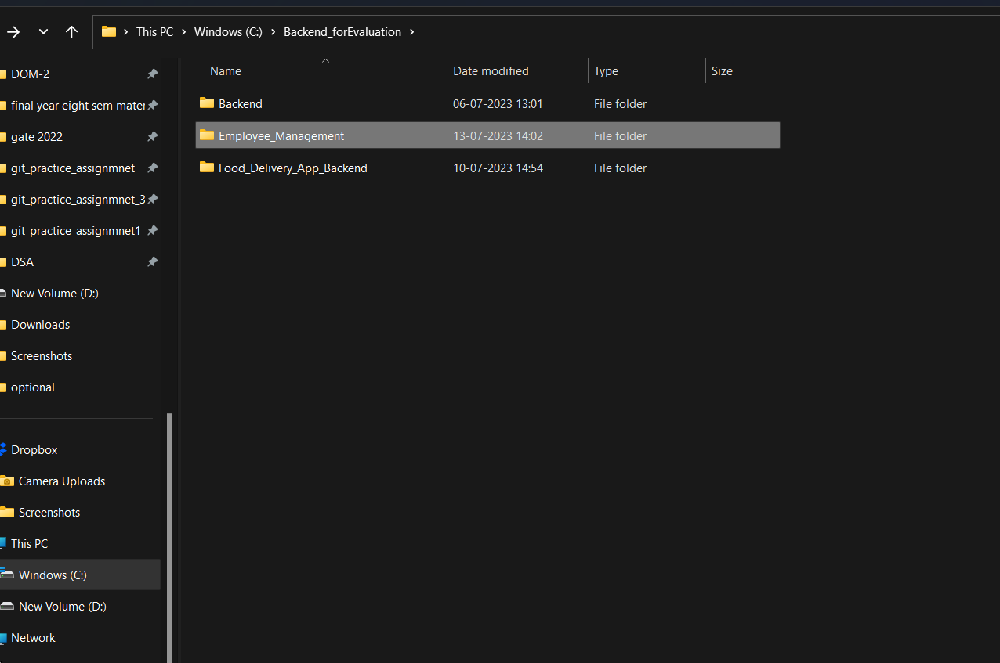

## netlify:-https://64b07f3f35ac1855a3b23bb9--glowing-faun-0fe8c1.netlify.app/ ###
## cyclic:- https://calm-teal-hen-yoke.cyclic.app/ ##
## Backend_git  ##

## USER

1. Login functionality:
   - When the login form is submitted, the `loginForm` element's submit event triggers an event listener.
   - The event listener prevents the default form submission behavior.
   - The entered email and password values are retrieved from the login form fields.
   - The `forpostingdataLogin()` function is called with the email and password as arguments.
   - The `forpostingdataLogin()` function sends a POST request to the `/user/login` endpoint with the email and password in the request body.
   - The request includes the `Content-Type` header set to `application/json`.
   - If the login request is successful, the server responds with a JSON object containing a message and a token.
   - The token is stored in the browser's local storage using `localStorage.setItem()` for later use.
   - If the login is successful, the `window.open()` method is called to open the "Employee.html" page.

2. Registration functionality:
   - When the registration form is submitted, the `registerform` element's submit event triggers an event listener.
   - The event listener prevents the default form submission behavior.
   - The entered email, password, and confirm password values are retrieved from the registration form fields.
   - The `forpostingdataReg()` function is called with the email, password, and confirm password as arguments.
   - The `forpostingdataReg()` function sends a POST request to the `/user/signup` endpoint with the email, password, and confirm password in the request body.
   - The request includes the `Content-Type` header set to `application/json`.
   - If the registration request is successful, the server responds with a JSON object containing a message.
   - An alert displays the registration message to the user.

These functions utilize the `fetch()` method to send HTTP requests to the server. The requests include the appropriate endpoint URL, method (POST), and request headers (Content-Type: application/json). The responses are handled using Promise-based syntax, including handling success and error scenarios.

Please note that the code assumes the existence of a `BaseUrl` variable pointing to the base URL of the server API.

### EMPLOYEE_FEATURES AND API
API Summary:

1. POST `/employees/add`: Adds a new employee to the database. It expects a JSON payload containing the employee's first name, last name, email, department, and salary.

2. GET `/employees`: Retrieves a list of employees from the database. It accepts parameters for pagination (`page` and `limit`) and returns a JSON response with the employee data.

3. GET `/employees/filterbydep`: Retrieves a filtered list of employees based on the department. It accepts parameters for pagination (`page` and `limit`) and the department (`department`). Returns a JSON response with the filtered employee data.

4. GET `/employees/sortbysalary`: Retrieves a sorted list of employees based on salary. It accepts parameters for pagination (`page` and `limit`) and the sorting order (`salary`). Returns a JSON response with the sorted employee data.

5. GET `/employees/searchbyname`: Retrieves a list of employees based on a search query by first name. It accepts parameters for pagination (`page` and `limit`) and the search query (`search`). Returns a JSON response with the matching employee data.

6. GET `/employees/getOneByID/:id`: Retrieves a specific employee by their ID. It requires the employee's ID as a parameter and returns a JSON response with the employee's details.

7. PATCH `/employees/edit/:id`: Updates the information of a specific employee. It requires the employee's ID as a parameter and expects a JSON payload containing the updated employee data.

8. DELETE `/employees/delete/:id`: Deletes a specific employee from the database. It requires the employee's ID as a parameter.

Features:

1. Filtering: The API supports filtering employees by department. It provides the `/employees/filterbydep` endpoint where you can specify the department as a parameter to retrieve a filtered list of employees.

2. Sorting: The API supports sorting employees by salary. Using the `/employees/sortbysalary` endpoint, you can specify the sorting order (ascending or descending) to retrieve a sorted list of employees based on their salary.

3. Search: The API allows searching for employees by their first name. The `/employees/searchbyname` endpoint accepts a search query parameter and returns a list of employees whose first names match the query.

4. Edit: The API provides an endpoint `/employees/edit/:id` to update the information of a specific employee. It requires the employee's ID and expects a JSON payload with the updated employee data.

5. Delete: The API supports deleting an employee using the `/employees/delete/:id` endpoint. It requires the employee's ID as a parameter to identify the employee to be deleted.

6. Pagination: All the API endpoints mentioned above support pagination. The page parameter is used to specify the current page number, and the limit parameter sets the number of employees to be displayed per page. The API responses include information about the total number of pages available, allowing clients to navigate through the employee data.
These features enable managing employee data by adding, filtering, sorting, searching, editing, and deleting employees through the provided API endpoints, with support for pagination to handle large datasets effectively.

These features enable managing employee data by adding, filtering, sorting, searching, editing, and deleting employees through the provided API endpoints.